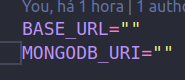
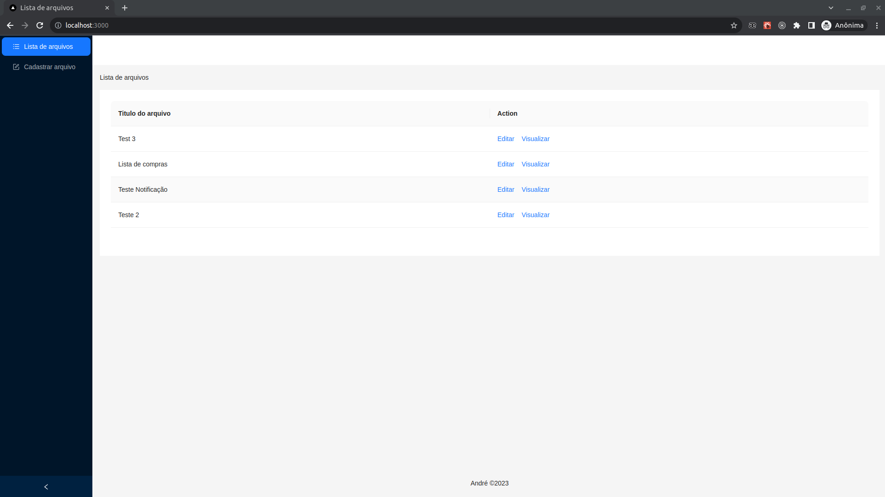
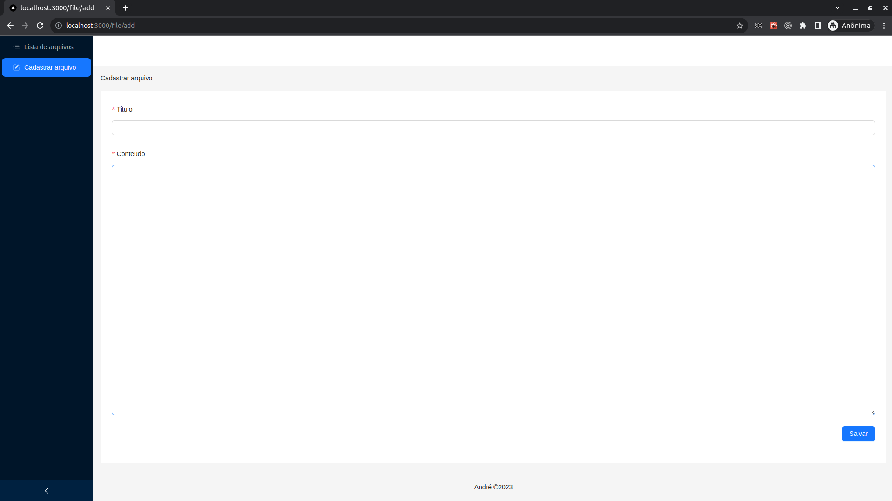
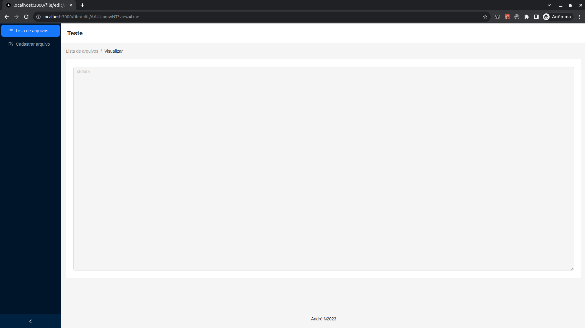

## <h1>Shopping list documentation</h1>

<h3>Initial setting</h3>

<h5>1. Env</h5>

It is necessary to make a copy of the .env.local.exemplo file, rename the file to .env and fill it with your data.

<h6>File</h6>

<h6>Fields to be filled</h6>

<h5>2. Commands</h5>

<ol>
  <li>yarn install</li>
  <li>yarn dev</li>
</ol>

<h5>3. Application usage steps</h5>

<ol>
  <li>Register a file</li>
  <li>find it in the file list</li>
  <li>click view</li>
</ol>

<h5>4. Application routes</h5>

Editing the file: just follow the steps listed above.

Real-time viewing: paste this address into your browser or send the link to the person who needs to see it. In both situations, you need to replace the id with the file id.

Note: It is possible to get the file id at the address of the editing screen, right after "edit/".

Viewing address: http://localhost:3000/file/edit/<strong>fileId</strong>?view=true

<h5>5. Project images</h5>

<h6>File list</h6>

<h6>File form</h6>

<h6>File editing allowed</h6>

<h6>Real-time editing preview</h6>

<h6>Video of the application working</h6>

